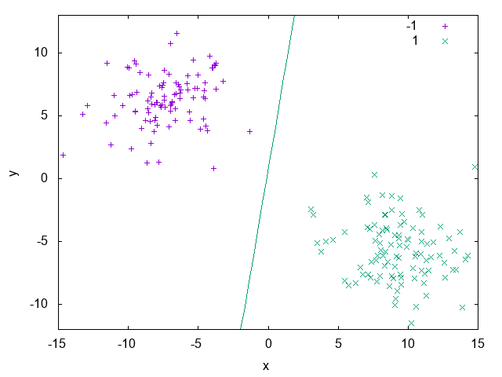
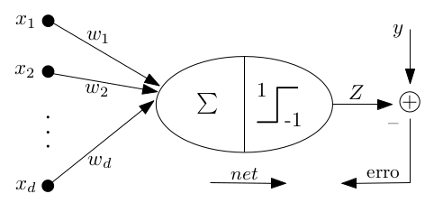
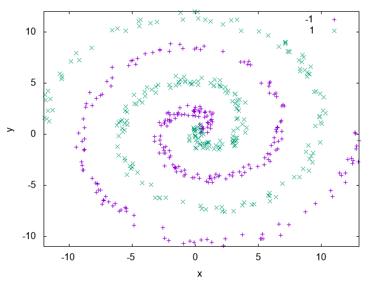
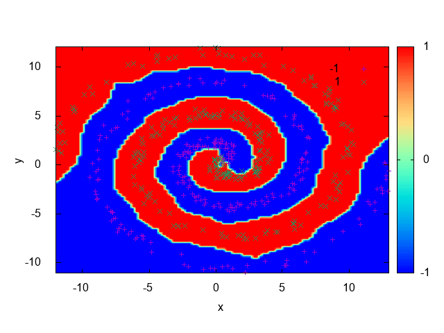
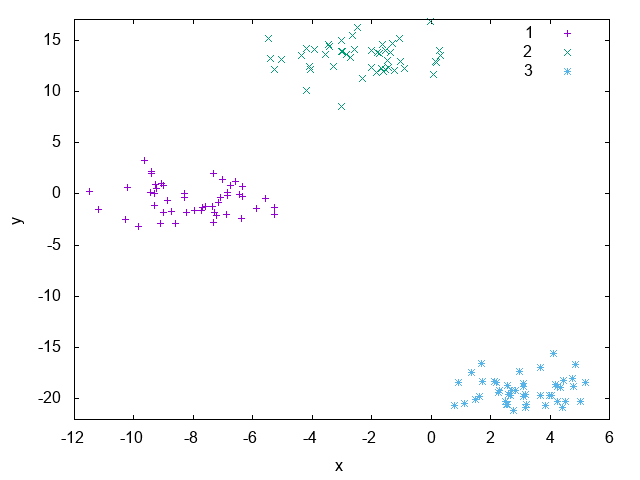
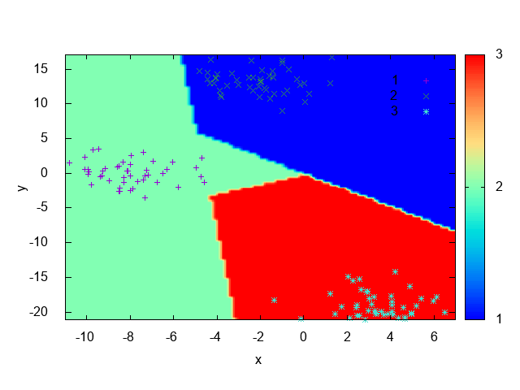
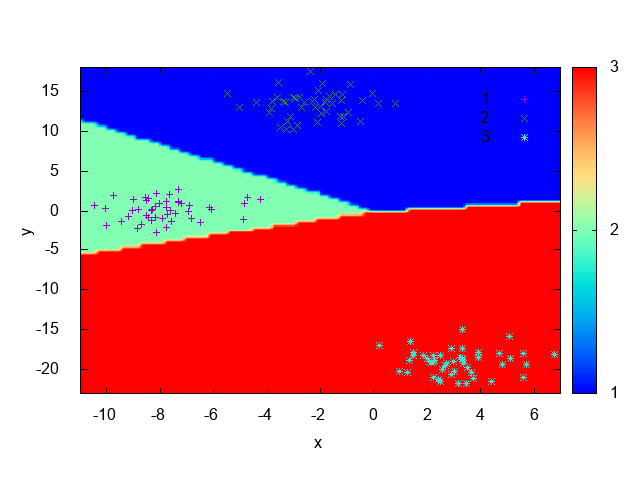

==============
Classification
==============

Often we are given the task, from ourselves or from others, to label things according to a set of already existing classes:

 * Is the object in the image a vehicle or a cat? 
 * Is this animal a dog or a cat? 

*Classification* is the problem of giving the right label to a record given as input. The task is different from regression because 
here we have discrete labels instead of continuous values [SKIENA2017]_. In this chapter we'll give a brief introduction on binary
and multi-class classification tasks and show how to tackle these problems using **UFJF-MLTK**.

Add ``#include <ufjfmltk/Classification.hpp>`` to include the classification module.

Binary classification
---------------------

  Example of a binary classification problem with a linear discriminant.

Let :math:`Z = (x_{i}, y_{i})` be a set of samples of size :math:`m`, where :math:`x_{i} \in R^{d}`, called input space of the problem,
:math:`y_{i}` is a scalar representing the class of each vector :math:`x_{i}` and for binary classification :math:`y_{i} \in \{+1,-1\}`,
for :math:`i = \{1, \dots, m\}`. A linear classifier, in a linearly separable input space, is represented by a hyperplane with the following equation [VILLELA2011]_:

.. math::
  
  h(x) = \langle w, x \rangle + b

The classification result can be obtained through a signal function :math:`\varphi` applied to the discriminant value associated to the hyperplane equation, i.e:

.. math::

  \varphi (h(x)) = 
  \begin{cases}
    +1,& \text{if } h(x) \geq 0\\
    -1,& \text{otherwise}
  \end{cases}

The Perceptron algorithm
^^^^^^^^^^^^^^^^^^^^^^^^

Considered the first learning algorithm, the Perceptron model is a pattern recognition model proposed by [ROSENBLATT1958]_. It's structured by
a input layer connecting each input unit to a component from a :math:`d`-dimension vector, and a output layer composed of :math:`m` units.
Therefore, it's an artificial neural network model with only one processing layer. In its simplest form, the Perceptron algorithm is a classification
algorithm involving only two classes [VILLELA2011]_.

  Perceptron model topology.

The algorithm developed by Rosenblatt can be utilized to determine the :math:`w` vector in a limited number of iterations, where the number of 
iterations is related to the number of updates of the weights vector. As the weights vector :math:`w` is determined by successive corrections in order
to minimize a loss function, we can say that the separating hyperplane is constructed in a iterative way characterizing an *online* learning process [VILLELA2011]_.   

.. code-block:: cpp
    :emphasize-lines: 9,11
    :caption: Primal Perceptron example
    :name: primal-perc

    #include <ufjfmltk/ufjfmltk.hpp>

    namespace vis = mltk::visualize;
    namespace classifier = mltk::classifier;

    int main() {
        mltk::Data<double> data("iris.data");
        vis::Visualization<> vis(data);
        classifier::PerceptronPrimal<double> perceptron(data);

        perceptron.train();

        vis.plot2DwithHyperplane(1, 2, perceptron.getSolution(), true);

        return 0;
    }

On :numref:`primal-perc` we can see a simple usage of the **UFJF-MLTK** perceptron implementation in it's primal form. In this example we first
load the binary ``iris.data`` dataset where two of the three original classes were merged into one in order to generate a binary problem, after that we instantiate
the ``PerceptronPrimal`` wrapper with the same data type as the dataset and the default parameters. With the object from the algorithm wrapper we call the 
method ``train`` to learn a model from the data and, finally, the decision boundary is ploted with features 1 and 2 from the dataset and passing the perceptron solution. :numref:`primal-perc-hyp`
shows the hyperplane generated by the model.

.. figure:: images/classification/ima-iris-2dsol.png
  :width: 450
  :align: center
  :name: primal-perc-hyp
  :alt: Solution generated from the model trained by the Perceptron classifier.

  Solution generated from the model trained by the Perceptron classifier.

Kernel methods
--------------

Often in real datasets is not possible to do a linear separation of the data. In these cases is necessary
to utilize more complex functions for labels separation. One way to define a non-linear separator is through 
a mapping function from input space :math:`X` to a higher dimensional space where the separation is possible [MEHRYAR2018]_.

In models based on a mapping from the fixed non-linear features space :math:`\Phi(x)`, the kernel function is defined
as following [BISHOP2007]_:

.. math::
  :label: kernel-func

  k(x, x^{'}) = \Phi(x)^{T}\Phi(x^{'})

:numref:`spirals-data` shows an example of a dataset that isn't linearly separable. It's composed of two spirals and as we can see, there isn't a way to
draw a line that separates the samples belonging to each spiral. In the `Dual Perceptron <#the-perceptron-dual-algorithm>`_ section we'll see how to solve this problem. 

  Spirals artificial dataset.

The simplest kernel considering the mapping on Eq. :math:numref:`kernel-func` is the linear kernel where 
:math:`\Phi(x) = x` and :math:`k(x, x^{'}) = x^{T}x`. The kernel concept formulated as a inner product in the 
input space allows the generalization of many known algorithms. The main idea is that if an algorithm is formulated
in such a way that the input vector :math:`x` is presented in a scalar product form, the inner product can be replaced
by another kernel product. This kind of extension is known as **kernel trick** or kernel substitution [BISHOP2007]_.

The Perceptron dual algorithm 
^^^^^^^^^^^^^^^^^^^^^^^^^^^^^

The derivation and implementation of the dual form of the Perceptron algorithm will be shown in Section ??, since it's a more complex topic. For now,
we'll use **UFJF-MLTK** implementation to solve the spirals dataset problem presented earlier. 

.. code-block:: cpp
  :name: dualperc-spirals
  :emphasize-lines: 9,11,12
  :caption: Dual perceptron training on spirals artificial dataset.

    #include <ufjfmltk/ufjfmltk.hpp>

    namespace vis = mltk::visualize;
    namespace classifier = mltk::classifier;

    int main() {
        auto data = mltk::datasets::make_spirals(500);
        vis::Visualization<> vis(data);
        classifier::PerceptronDual<double> perceptron(data, mltk::KernelType::GAUSSIAN, 1);

        perceptron.setMaxTime(500);
        perceptron.train();

        vis.plotDecisionSurface2D(perceptron, 0, 1, true, 100);
        return 0;
    }

:numref:`dualperc-spirals` example generates a spirals 
dataset with 500 samples using the ``make_spirals`` function from ``mltk::datasets::`` namespace, initialize the visualization object and instantiate the ``PerceptronDual``
wrapper with a gaussian kernel with standard deviation of 1.0 as a kernel parameter. To guarantee the algorithm convergence, the maximum training time of the algorithm
is set as 500ms, after that, the model is trained and its decision boundary is ploted as in :numref:`spirals-dualperc-dec`.

  Decision contour surface from Perceptron dual for spirals dataset.

Multi-class classification
--------------------------

Until now we've been discussing algorithms for classification problems were we have only two labels, but often we face problems where we need
to choose a class between tens, hundreds or even thousands of labels, like when we need to assign a label to an object in an image. In this chapter, we'll 
be analysing the problem of multi-class classification learning.

Let :math:`\mathcal{X}` be the input space and :math:`\mathcal{Y}` the output space, and let :math:`\mathcal{D}` be an unknown distribution over :math:`\mathcal{X}` according
to which input points are drawn. We'll be distinguishing between the *mono-label* (binary classification) and *multi-label* cases, where we define :math:`\mathcal{Y}` as a set 
of discrete values as :math:`\mathcal{Y} = \{1, \dots, k\}` and :math:`\mathcal{Y} = \{+1, -1\}^{k}` for the *mono-label* and *multi-label* cases, respectively. In the *mono-label* case,
each sample will be assigned to only one class, while in the *multi-label* there can be several. The latter can be illustrated as the positive value being the component of a vector 
representing the classes where the example is associated [MEHRYAR2018]_.

On both cases, the learner receives labeled samples :math:`\mathcal{S} = ((x_1, y_1), \dots, (x_m, y_m)) \in (\mathcal{X}, \mathcal{Y})^{m}` with :math:`x_1, \dots, x_m` drawn according
to :math:`\mathcal{D}`, and :math:`y_i = f(x_i)` for all :math:`i \in [1, \dots, m]`, where :math:`f:\mathcal{X} \rightarrow \mathcal{Y}` is the target labeling function. The multi-class classification problem consists
of using labeled data :math:`\mathcal{S}` to find a hypothesis :math:`h \in H`, where :math:`H` is a hypothesis set containing functions mapping :math:`\mathcal{X}` to :math:`\mathcal{Y}`. The multi-class classification problem consists on finding the hypothesis :math:`h \in H` using the labeled data :math:`\mathcal{S}`, such that 
it has smallest generalization error :math:`R(h)` with respect to the target :math:`f`, where Eq. :math:numref:`mono` refers to the *mono-label* case and Eq. :math:numref:`multi` to the *multi-label* case [MEHRYAR2018]_.

.. math::
  :label: mono

  R(h) = \mathop{\mathbb{E}}_{x \sim \mathcal{D}} [1_{h(x) \neq f(x)}]

.. math::
  :label: multi

  R(h) = \mathop{\mathbb{E}}_{x \sim \mathcal{D}} [\sum_{l=1}^{k} 1_{[h(x)]_l \neq [f(x)]_l}]

In the following sections we'll be discussing two algorithms for adapting models for binary classification to the multi-class case, namely One-vs-All and One-vs-One. For that,
the blobs artificial dataset generated with 50 examples for each of 3 labels. The plot for the dataset data can be seen on :numref:`blobs-3class`.

  Blobs artificial dataset.

The One-vs-All algorithm
^^^^^^^^^^^^^^^^^^^^^^^^

This method consists in learning :math:`k` binary classifiers :math:`h_l:\mathcal{X} \rightarrow {-1, +1}`, :math:`l \in \mathcal{Y}`, each one of them 
designed to discriminate one class from all the others. Each :math:`h_l`, for any :math:`l \in \mathcal{Y}`, is constructed by training a binary classifier after
relabeling points in class :math:`l` with 1 and all the others as -1 on the full sample :math:`\mathcal{S}`. The multi-class hypothesis :math:`h:\mathcal{X} \rightarrow \mathcal{Y}` defined by the
One-vs-All (OVA) technique is given by [MEHRYAR2018]_:

.. math::

  \forall x \in \mathcal{X},\; h(x) = \mathop{arg\,max}_{l\in\mathcal{Y}}f_l(x)

:numref:`ova-example` shows how to use the **UFJF-MLTK** primal perceptron implementation with the OVA technique to tackle the blobs dataset classification problem.
As can be seen, the only thing needed to do is to instantiate the ``OneVsAll`` wrapper and pass the training data and the algorithm wrapper to be used. Something to be noted, is that
the base algorithm parameters must be passed on its initialization or before calling the OVA ``train`` method.

.. code-block:: cpp
  :emphasize-lines: 9,10,12
  :name: ova-example
  :caption: OVA example with the primal perceptron model.

    #include <ufjfmltk/ufjfmltk.hpp>

    namespace vis = mltk::visualize;
    namespace classifier = mltk::classifier;

    int main() {
        auto data = mltk::datasets::make_blobs(50, 3, 2, 1.5, -20, 20, true, true, 10).dataset;
        vis::Visualization<> vis(data);
        classifier::PerceptronPrimal<double> perceptron;
        classifier::OneVsAll<double> ova(data, perceptron);

        ova.train();

        vis.plotDecisionSurface2D(ova, 0, 1, true, 100, true);
        return 0;
    }

:numref:`blobs-contour-ova-perc` shows the decision boundary generated after training, it's possible to note that 
each region drawn accomodates points with the same class, indicating that the technique was effective on learning 
a aproximation of the data distribution. For non linearly separated data, the only changes is that we need 
to use an algorithm capable of learning a non-linear function like the dual perceptron from ``PerceptronDual`` wrapper. 

    Decision contour surface from OVA with perceptron for blobs dataset.

The One-vs-One algorithm
^^^^^^^^^^^^^^^^^^^^^^^^

The One-vs-One (OVO) technique consists in learning a binary classifier :math:`h_{ll^{'}}:\mathcal{X}\rightarrow {-1, +1}` for each pair of distinct classes :math:`(l, l^{'}) \in \mathcal{Y}`, :math:`l \neq l^{'}`, 
discriminating :math:`l` and :math:`l^{'}`. :math:`h_{ll^{'}}` is obtained by training a binary classifier on the sub-sample containing exactly the points labeled as :math:`l` and :math:`l^{'}`,
with the value +1 returned for :math:`l^{'}` and -1 for :math:`l`. For that, it's needed to train :math:`\binom{k}{2} = \frac{k(k-1)}{2}` classifiers, which are combined to define a multi-class classification hypothesis :math:`h`
via majority vote [MEHRYAR2018]_:

.. math::

  \forall x \in \mathcal{X},\; h(x) = \mathop{arg\,max}_{l^{'} \in \mathcal{Y}}| \{l:h_{ll^{'}}(x) = 1\} |

.. code-block:: cpp
  :emphasize-lines: 9,10,12
  :name: ovo-example
  :caption: OVO example with the primal perceptron model.

    #include <ufjfmltk/ufjfmltk.hpp>

    namespace vis = mltk::visualize;
    namespace classifier = mltk::classifier;

    int main() {
        auto data = mltk::datasets::make_blobs(50, 3, 2, 1.5, -20, 20, true, true, 10).dataset;
        vis::Visualization<> vis(data);
        classifier::PerceptronPrimal<double> perceptron;
        classifier::OneVsOne<double> ovo(data, perceptron);

        ovo.train();

        vis.plotDecisionSurface2D(ovo, 0, 1, true, 100, true);

        return 0;
    }

:numref:`ovo-example` is analogous to :numref:`ova-example` except that it's using the ``OneVsOne`` wrapper instead of the OVA one.
As expected, it could also learn the data distribution, this can be seen by the decision boundary shown at :numref:`blobs-contour-ovo-perc`.

  Decision contour surface from OVO with perceptron for blobs dataset.

Model evaluation and selection
------------------------------

So far, you may have been able to build a classifier, but only that is not enough. Supose you've trained a model to predict the purchasing behavior of future clients using data from 
previous sales. For that, you need to estimate how accurately your model can be on unseen data, i.e, how accurately your model can predict the behavior of future customers. You may have built
several classifiers and need to compare how well they can be between each other [HAN2011]_. This section address metrics that can be used to compare those methods and how reliable this comparison can be.  

Metrics for classifiers evaluation
^^^^^^^^^^^^^^^^^^^^^^^^^^^^^^^^^^

The usage of training data for accuracy estimation of a classifier, can lead to overoptimistic estimates due to overspecialization of the model to the data.
A better option to avoid this issue is to measure the classifier accuracy using a *test set*, that is are examples from the entire dataset that weren't used
during model training [HAN2011]_.

In this section we'll be discussing several metrics to measure a classifier performance, but before we need to be confortable with some terminologies that'll be 
used throghout metrics definitions. Two important terms are **positive samples**, points labeled with the class of main interest, and **negative samples**, that are 
the rest of the samples. Given two classes, for example, the positive samples may be *buy_computer = yes* and the negative samples *buy_computer = no*. Supose 
a classifier is used on a *test set* of labeled data. :math:`P` is the number of positive samples and :math:`N` is the number of negative samples. for each sample we compare
For each sample, we compare the predictions made by the classifier with the sample known class. There are four other terms that must be understood since they are the 
building blocks of many evaluation measures computations [HAN2011]_.

* **True positives** (TP): positive samples that were correctly labeled by the classifier;
* **True negatives** (TN): negative samples that were correctly labeled by the classifier;
* **False positives** (FP): positive samples that were incorrectly labeled as negative;
* **False negatives** (FN): negative samples that were incorrectly labeled as positive;

A **confusion matrix** is a tool used to analyse if the classifier is doing well on prediction of examples of different classes. TP and 
TN indicates if the classifier is labeling right. FN and FP tells when the classifier is doing wrong predictions. These terms are sumarized
on the confusion matrix from :numref:`cfm-example`. It's a matrix at least  of size *m* x *m* where *m* is the number of classes, an entry 
:math:`CM_{ij}` represents the number of examples from class :math:`i` that were labeled as :math:`j` [HAN2011]_. 

.. table:: Confusion matrix where the lines represent the **actual class** and the columns the **predicted class**.
  :align: center
  :name: cfm-example

  +-------+-------+-------+
  |       | *yes* |  *no* |
  +-------+-------+-------+
  |*yes*  |    TP |    FN |
  +-------+-------+-------+
  | *no*  |    FP |    TN |
  +-------+-------+-------+
  |*Total*|    P' |    N' |
  +-------+-------+-------+

Below is a list of important metrics for classifiers evaluation and selection:

* **Accuracy**: percentage of examples on the test set that were correctly classified.

.. math::

  accuracy = \frac{TP + TN}{P + N}

* **Error rate**: is :math:`1 - accuracy(M)` where :math:`accuracy(M)` is 
the accuracy of the classifier :math:`M`. It can also be computed as follows:

.. math::

  error\;rate = \frac{FP + FN}{P + N}

* **Sensitivity** and **Specificity**: are the proportion of the positive samples that were correctly classified and the true negative proportion, respectively. 

.. math::

  sensitivity = \frac{TP}{P}

  specificity = \frac{TN}{N} 

* **Precision**: can be thought as a measure of exactness, i.e, the percentage of examples labeled as positive are actually such.

.. math::

  precision = \frac{TP}{TP + FP}

* **Recall**: is a measure of completeness, i.e, the percentage of positive samples labeled as such, the same as *sensitivity*.

.. math::

  recall = \frac{TP}{TP + FN}

Holdout method and random subsampling
^^^^^^^^^^^^^^^^^^^^^^^^^^^^^^^^^^^^^

With the **holdout** method the data is randomly partitioned in two independent sets, the *training set* and the *test set*. Usually, two thirds of the data is reserved for
training and one third for testing. The training set is used to train the model and the test set for estimating the accuracy. The problem of this method is that it usually 
pessimistic because only a portion of the data is used to derive the model.

**Random subsampling** is a variation of the holdout method where the holdout method is repeated :math:`k` times. The accuracy estimate is given as the average of the 
accuracies obtained from each iteration.

Cross-validation
^^^^^^^^^^^^^^^^

.. [SKIENA2017] Skiena, Steven S. The data science design manual. Springer, 2017.
.. [VILLELA2011] Villela, Saulo Moraes, et al. "Seleção de Características utilizando Busca Ordenada e um Classificador de Larga Margem." (2011).
.. [ROSENBLATT1958] Rosenblatt, Frank. "The perceptron: a probabilistic model for information storage and organization in the brain." Psychological review 65.6 (1958): 386.
.. [MEHRYAR2018] Mohri, Mehryar, Afshin Rostamizadeh, and Ameet Talwalkar. Foundations of machine learning. MIT press, 2018.
.. [BISHOP2007] Bishop, Christopher M. "Pattern recognition and machine learning (information science and statistics)." (2007).
.. [HAN2011] Han, Jiawei, Jian Pei, and Micheline Kamber. Data mining: concepts and techniques. Elsevier, 2011.